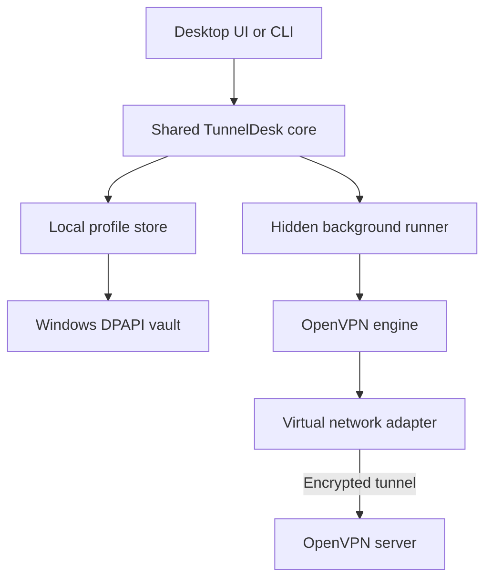

# TunnelDesk

TunnelDesk is a hybrid Windows application for managing multiple OpenVPN profiles from either a visual dashboard or the terminal. Both interfaces use the same local profiles, encrypted credentials, connection state, and OpenVPN engine.

> [!NOTE]
> This repository contains the first functional MVP. It is ready for development and testing with non-production profiles, but it is not yet a signed Windows installer.

## What works

- Import multiple `.ovpn` configurations under friendly profile names.
- Save each profile's username and password encrypted with Windows DPAPI.
- Connect, disconnect, inspect status, and read logs from the CLI.
- Use the exact shortcut syntax `tunneldesk connect --work-vpn`.
- Open a local visual dashboard by running `tunneldesk`.
- Configure automatic VPN connection when the Windows user signs in.
- Detect OpenVPN from `PATH` or its usual Windows installation folder.
- Keep managed configurations, credentials, state, and logs under the user's local app data.
- Redact authentication-related OpenVPN log entries.
- Prevent duplicate runners for the same profile and isolate state by connection session.
- Reconnect after an established tunnel drops when the profile policy enables it.

## Architecture



The visual dashboard is served only on a random `127.0.0.1` port by the same executable. It does not upload data or expose a public server. A hidden TunnelDesk runner supervises each OpenVPN process, allowing the terminal command to finish while the VPN continues running. The CLI waits for OpenVPN's real `Initialization Sequence Completed` signal before reporting a successful connection.

## Download

After the first release is published, download only `tunneldesk-windows-amd64.exe` from [GitHub Releases](https://github.com/Felipyan19/tunneldesk/releases). OpenVPN Community must still be installed separately.

To verify the download in PowerShell:

```powershell
(Get-FileHash .\tunneldesk-windows-amd64.exe -Algorithm SHA256).Hash
Get-Content .\SHA256SUMS.txt
```

Maintainers can publish a version without compiling locally:

1. Open **Actions** → **Publish Windows release**.
2. Choose **Run workflow**.
3. Enter a semantic version such as `v0.1.0`.
4. Download the executable from the automatically created GitHub Release.

Do not publish a release until the executable has been tested against a non-production OpenVPN profile on Windows.

## Requirements

- Windows 10 or Windows 11.
- Go 1.24 or later to build from source.
- OpenVPN Community installed, including its virtual network adapter.
- A valid `.ovpn` file and access to its VPN server.
- User/password authentication for the current MVP.

TunnelDesk finds `openvpn.exe` from `PATH` and common installation locations. A custom path can be configured before launching it:

```powershell
$env:TUNNELDESK_OPENVPN = "C:\OpenVPN\bin\openvpn.exe"
```

## Build

```powershell
go build -trimpath -o bin\tunneldesk.exe .\cmd\tunneldesk
```

Optionally copy `bin\tunneldesk.exe` to a directory included in `PATH`, so `tunneldesk` is available from any terminal.

## First-time setup

Import a configuration:

```powershell
tunneldesk profile add work-vpn --config "C:\VPN\work-vpn.ovpn"
```

Save its credentials. The password prompt is hidden and the resulting data is encrypted for the current Windows user:

```powershell
tunneldesk credentials set work-vpn
```

Connect:

```powershell
tunneldesk connect --work-vpn
```

## CLI reference

```powershell
# Open the visual dashboard
tunneldesk

# Profile management
tunneldesk profile add work-vpn --config "C:\VPN\work-vpn.ovpn"
tunneldesk profile remove work-vpn
tunneldesk profiles

# Credentials
tunneldesk credentials set work-vpn

# VPN connection
tunneldesk connect --work-vpn
tunneldesk status --work-vpn
tunneldesk logs --work-vpn
tunneldesk disconnect --work-vpn

# Connect when the Windows user signs in
tunneldesk autostart enable --work-vpn
tunneldesk autostart disable --work-vpn
```

Named flags are intentional: `--work-vpn`, `--personal`, or `--client-a` selects the profile to operate.

## Visual mode

Run:

```powershell
tunneldesk
```

TunnelDesk opens a browser-based local desktop dashboard where you can:

- Import profiles.
- Enter encrypted credentials.
- See connection status.
- Connect and disconnect.

The dashboard and terminal are not separate products. Importing `work-vpn` visually makes it immediately available to `tunneldesk connect --work-vpn`, and a profile imported in the terminal appears in the dashboard.

## Local data and security

TunnelDesk stores its files under:

```text
%LOCALAPPDATA%\TunnelDesk\
```

```text
TunnelDesk
└── profiles
    └── work-vpn
        ├── client.ovpn
        ├── credentials.dpapi
        ├── profile.json
        ├── state.json
        ├── connection.lock
        └── openvpn.log
```

- `credentials.dpapi` can be decrypted only in the Windows user context that created it.
- Passwords are never written into `profile.json`, command-line arguments, or logs.
- OpenVPN receives credentials through standard input; TunnelDesk does not create a plaintext authentication file.
- The OpenVPN option `auth-nocache` asks the engine not to retain credentials in memory after use.
- The dashboard binds only to loopback, requires a random per-launch session cookie, checks the request host and origin, and adds restrictive browser security headers.
- TunnelDesk verifies the executable path before stopping a stored PID, requests a graceful stop first, and force-stops only after a timeout.
- Relative certificate and key paths continue to resolve from the directory where the imported `.ovpn` originated. Keep those referenced files in place.
- Real `.ovpn`, certificate, key, DPAPI, state, and log files must never be committed.

> [!WARNING]
> An `.ovpn` file may contain embedded private keys. Never add a real company or personal profile to this repository.

## Current limitations

- Windows only for secure credential storage and VPN execution.
- The visual mode currently opens in the default browser rather than a native Wails window.
- Profiles that require MFA, interactive challenges, smart cards, or external browser login are not supported yet.
- A Windows service, system tray support, installer signing, and split tunneling controls remain roadmap items.
- Profiles with external certificates or keys depend on their original directory; moving those files after import breaks the profile.
- OpenVPN and its adapter must already be installed.

## Roadmap

- [x] Shared profile model for GUI and CLI.
- [x] Multiple named `.ovpn` profiles.
- [x] DPAPI-encrypted credentials.
- [x] Background OpenVPN runner.
- [x] CLI with `--profile-name` shortcuts.
- [x] Loopback-only visual dashboard.
- [x] Per-profile Windows autostart.
- [x] Session-aware state, duplicate-runner protection, and reconnection policy.
- [x] Native Windows tests and Windows CI build.
- [ ] Native Wails window and system tray.
- [ ] Windows service with named-pipe IPC.
- [ ] Rich health monitoring and configurable reconnect policy.
- [ ] MFA and OpenVPN management-interface support.
- [ ] Signed installer and automatic updates.

## Development checks

```powershell
gofmt -w .
go vet ./...
go test -race ./...
$env:GOOS = "windows"
$env:GOARCH = "amd64"
go build -trimpath -o bin\tunneldesk.exe .\cmd\tunneldesk
```

GitHub Actions runs formatting, vet, tests, and the race detector on both Linux and a native Windows runner. It also builds the Windows executable on every pull request.

## License

[MIT](LICENSE)
