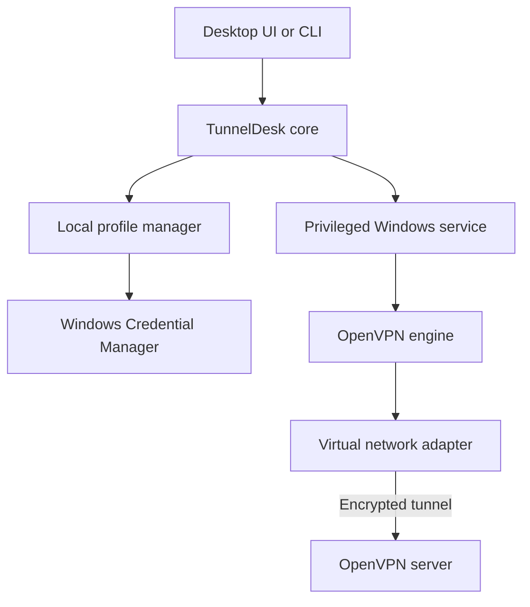

# TunnelDesk

A Windows desktop client and command-line interface for managing multiple OpenVPN profiles without repeatedly entering credentials.

> [!IMPORTANT]
> TunnelDesk is currently in the design and early-development stage. The commands and architecture below describe the planned MVP.

## The idea

TunnelDesk provides one place to import, manage, connect, and disconnect multiple OpenVPN profiles. Each profile keeps its own configuration and credentials locally on the Windows computer.

Once a profile such as `motai` has been configured, connecting should be as simple as:

```powershell
tunneldesk connect --motai
```

TunnelDesk replaces the OpenVPN Connect user interface, but it still uses the OpenVPN engine and protocol underneath. It does not modify the remote VPN server or convert OpenVPN configurations to WireGuard.

## Planned features

- Import and manage multiple `.ovpn` profiles.
- Connect or disconnect from the desktop app.
- Connect, disconnect, and inspect status from the terminal.
- Store credentials locally with Windows Credential Manager.
- Enable or disable launch and connection at Windows startup per profile.
- Run OpenVPN silently in the background.
- Display connection state and readable logs.
- Reconnect automatically after an unexpected disconnection.
- Minimize the desktop app to the Windows system tray.
- Keep VPN configuration and secrets on the local computer.

## Example CLI

```powershell
# Profiles
tunneldesk profile add motai --config "C:\VPN\motai.ovpn"
tunneldesk profiles

# Connection
tunneldesk connect --motai
tunneldesk disconnect --motai
tunneldesk status --motai
tunneldesk logs --motai

# Windows startup
tunneldesk autostart enable --motai
tunneldesk autostart disable --motai
```

The project intentionally supports named flags such as `--motai` for quick daily use. A conventional positional form such as `tunneldesk connect motai` may also be supported later.

## How it works



1. The user imports an existing `.ovpn` configuration and assigns it a profile name.
2. TunnelDesk saves non-secret profile metadata in the user's local application data.
3. Credentials are stored through Windows Credential Manager instead of a plaintext configuration file.
4. The desktop UI or CLI sends a local command to the TunnelDesk service.
5. The service starts `openvpn.exe` with the selected profile and the required privileges.
6. TunnelDesk reads the OpenVPN management interface or process output to report connection state and logs.
7. On disconnect, the service stops the session and OpenVPN restores the affected routes.

## Proposed architecture

| Component | Responsibility |
|---|---|
| Desktop UI | Profile setup, connection controls, status, and logs |
| CLI | Scriptable access to the same operations as the desktop UI |
| Core | Profile validation, commands, state, and application rules |
| Windows service | Privileged OpenVPN process and network control |
| Credential store | Encrypted credentials scoped to the Windows user |
| OpenVPN engine | Tunnel negotiation, encryption, routing, and adapter management |

The UI and CLI will share the same core instead of implementing connection behavior twice.

## Local security model

TunnelDesk is designed around local-only operation:

- No credentials are uploaded to a cloud service.
- Passwords are not committed to the repository or stored in plaintext.
- Secrets are retrieved only when a connection is started.
- The local service accepts commands only from authorized Windows users.
- Logs must redact passwords, private keys, and sensitive arguments.
- Temporary authentication files, if required by OpenVPN, must use restricted permissions and be deleted immediately after use.
- Imported profiles must never expose embedded private keys through the UI or logs.

> [!WARNING]
> An `.ovpn` file may contain certificates or private keys. Never publish a real company or personal VPN configuration in this repository.

## Profile model

A profile will contain metadata similar to:

```json
{
  "name": "motai",
  "configPath": "%LOCALAPPDATA%\\TunnelDesk\\profiles\\motai\\client.ovpn",
  "autoStart": false,
  "autoConnect": false,
  "reconnect": true
}
```

Credentials are deliberately excluded from this file. The profile stores only a reference to the corresponding Windows Credential Manager entry.

## MVP roadmap

- [ ] Define profile and configuration models.
- [ ] Implement profile import and validation.
- [ ] Integrate Windows Credential Manager.
- [ ] Implement OpenVPN process lifecycle and status parsing.
- [ ] Build the CLI and named profile flags.
- [ ] Add the privileged Windows service.
- [ ] Build the desktop interface and system tray.
- [ ] Add startup and auto-connect configuration.
- [ ] Add redacted structured logs.
- [ ] Package and test the Windows installer.

## Intended technology

The initial implementation is planned in Go because it can produce small Windows binaries and share application logic between the service and CLI. The desktop interface can use Wails with a lightweight HTML, CSS, and JavaScript frontend.

OpenVPN remains responsible for the VPN protocol. TunnelDesk focuses on secure credential handling, profile management, automation, and a better Windows experience.

## Requirements

The first version is expected to require:

- Windows 10 or Windows 11.
- A valid OpenVPN `.ovpn` configuration.
- Access to an OpenVPN-compatible server.
- Administrator approval during installation of the service and network components.
- The OpenVPN engine and compatible virtual network adapter, bundled or detected by the installer.

## Project goals

TunnelDesk is intended to demonstrate practical experience with:

- Go desktop and CLI development.
- Windows services and process management.
- Secure local credential storage.
- VPN configuration and network lifecycle management.
- Inter-process communication.
- Structured logging and secret redaction.
- Windows startup integration and application packaging.

## License

A license has not been selected yet.
